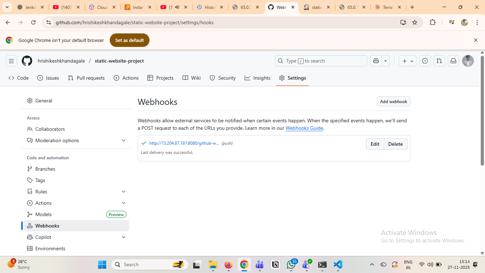

# Handyman Website - Terraform & Jenkins CI/CD

A complete infrastructure-as-code solution for deploying a static handyman/remodelling business website on AWS EC2 with automated deployment using Jenkins.

## 🏗️ Project Overview

This project demonstrates:
- **Infrastructure as Code (IaC)** using Terraform
- **Automated deployment** with Jenkins CI/CD pipeline
- **Web server** using Nginx on Ubuntu EC2
- **Static website** for handyman services

 ## ✅Step 1 — Deploy EC2 instance using Terraform & Install Nginx

In this project, the EC2 instance was created using Terraform.
Along with EC2 provisioning, Nginx was automatically installed using User Data script.

Terraform performed:

EC2 Launch

Security Group creation (Port 22 & 80 allowed)

Nginx installation & webpage setup through shell script

## ✅Step 2 — I created the Jenkinsfile for CI/CD

After deploying the EC2 instance using Terraform, I created the Jenkinsfile to automate the deployment process.

The Jenkinsfile performs the following tasks 👇

Pull the latest code from GitHub

Connect to the EC2 instance using SSH

Copy the website files to the default Nginx path /var/www/html

Restart Nginx to make the updated website live

## ✅Step 3 — Then I created the Jenkins Pipeline

After writing the Jenkinsfile, I created a Jenkins Pipeline job and connected it with my GitHub repository.

In this pipeline:

Jenkins reads the Jenkinsfile from the repo

On every build, Jenkins deploys the latest code to the EC2 server

The website in /var/www/html gets updated automatically

So now the whole deployment process runs through the pipeline
→ No manual commands
→ No manual uploading of files
→ Everything is automated

## ✅Step 4 — After that I added the GitHub Webhook

Next, I added the GitHub Webhook so that the deployment becomes fully automatic.

With the webhook:

Whenever I push code to GitHub

GitHub sends a trigger to Jenkins

Jenkins automatically starts the pipeline and deploys the latest code to the EC2 server

So now the flow is completely automatic:
Push Code → Jenkins Pipeline → Deploy to /var/www/html → Live Website

No need to press Build Now manually anymore

## ✅Step 5 — Finally the website became visible in the browser

After the webhook and the Jenkins pipeline were configured successfully, I pushed my code to GitHub.
Jenkins automatically deployed the updated files to the EC2 server, and the website became live.

I opened the EC2 public IP in the browser and the website was successfully visible from the Nginx server.

📌 Final result:
http://65.0.73.224/→ Website LIVE 🎉

Now the whole flow works automatically:
Code Push → Jenkins Pipeline → Deployment to /var/www/html → Website Live in Browser

This complete project was designed and implemented by me.
From provisioning the EC2 instance using Terraform to configuring Jenkins CI/CD with GitHub Webhook and deploying the static website on Nginx — every step was done by myself.

### It was a great hands-on DevOps experience and helped me understand:

Infrastructure as Code (Terraform)

Continuous Integration & Continuous Deployment (Jenkins)

Automation using GitHub Webhooks

Deployment on AWS EC2 with Nginx